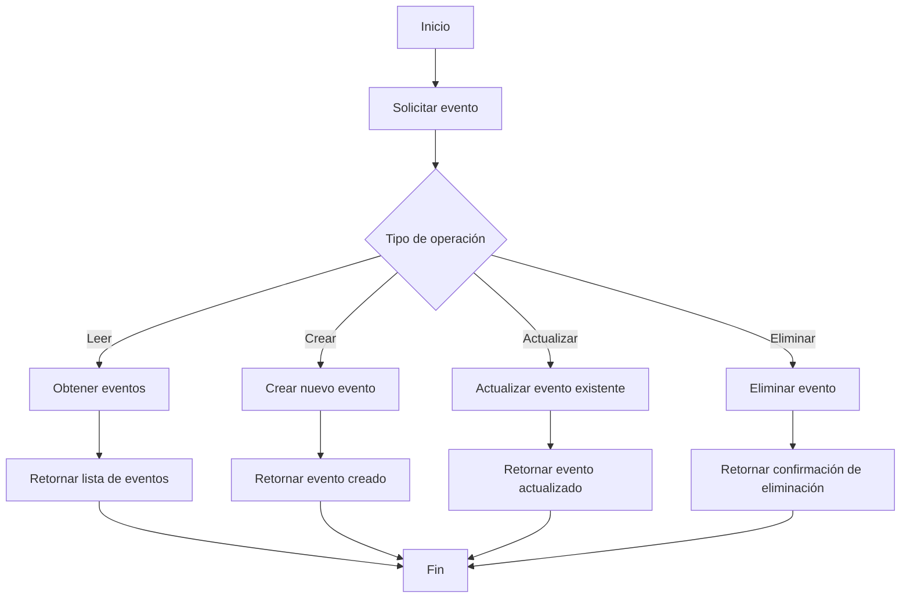

## mejoras correcciones 
#Visualizacion de docker hub con automatizacion ( haciendo referencia al proyecto  de apis y funicones valle y jarro ) 
# Link de docker hub 
'''
https://hub.docker.com/layers/palbertt/proyecto-si8811a-2024-ii-u1-apis-y-funciones-jarro-y-valle/latest/images/sha256-c3f301fe87bab319eeea16870779fe9e272c406a5750b307d51e2091440a35f6?context=explore
'''
- 


## Explicacion del DockerHub implementando en la API


# Proyecto SI-8811-A

Bienvenido al proyecto SI-8811, una API para gestionar eventos utilizando .NET y MongoDB. Este proyecto está diseñado para facilitar la creación, lectura, actualización y eliminación de eventos en un entorno académico.

# Integrantes 
 - Jose Luis Jarro C.
 - Gustavo Alonso Valle Bustamante 

## Diagrama Api .Net


### Descripción de Componentes

- **Cliente**: El usuario o aplicación que hace solicitudes a la API.
- **EventosController**: Controlador que maneja las solicitudes HTTP.
- **MongoDB Eventos**: Base de datos para almacenar los eventos.
- **Validaciones**: Lógica para validar los datos de entrada.
- **Autenticación**: Mecanismo de seguridad para acceso a la API.
- **Manejo de Errores**: Gestión de errores y respuestas adecuadas.


## Índice

- [Tecnologías Utilizadas](#tecnologías-utilizadas)
- [Configuración del Proyecto](#configuración-del-proyecto)
- [Uso de Git](#uso-de-git)
- [GitHub Actions](#github-actions)
- [Publicación](#publicación)
- [Contribución](#contribución)
- [Documentación](#documentación)

## Tecnologías Utilizadas

- **.NET Core**: Framework para construir la API.
- **MongoDB**: Base de datos NoSQL para almacenar información de eventos.
- **Git**: Control de versiones.


## Configuración del Proyecto

1. **Clonar el Repositorio**:
   ```bash
   git clone https://github.com/tuusuario/proyecto-si-8811.git
   cd proyecto-si-8811
   ```

2. **Configuración de MongoDB**:
   - Crea un archivo `appsettings.json` en la raíz del proyecto y añade la configuración de MongoDB:
   ```json
   {
     "Logging": {
       "LogLevel": {
         "Default": "Information",
         "Microsoft.AspNetCore": "Warning"
       }
     },
     "MongoDBSettings": {
       "ConnectionString": "TuCadenaDeConexion",
       "DatabaseName": "TuNombreDeBaseDeDatos"
     }
   }
   ```

3. **Ejecutar el Proyecto**:
   - Usa el siguiente comando para ejecutar la API:
   ```bash
   dotnet run
   ```

## Uso de Git

- Este proyecto utiliza **GitFlow** como modelo de branching. Las ramas se crean para cada nueva característica o corrección de errores, asegurando un flujo de trabajo organizado.
- **Tareas completadas**: Las tareas del proyecto están registradas en **GitHub Projects** y están vinculadas a las respectivas ramas.

## GitHub Actions

- Se han implementado **GitHub Actions** para automatizar la construcción y el despliegue del proyecto, asegurando una integración continua y un despliegue seguro.

## Publicación

- El proyecto ha sido publicado para consumo, pero **no** se encuentra disponible en GitHub.
- Se utilizó **Elastika** para la gestión y despliegue de la API, facilitando el acceso y la escalabilidad del servicio.




## Exposición

- El proyecto ha sido presentado, y se ha utilizado herramientas adecuadas para su exposición. 
- El enfoque y la claridad en la presentación fueron bien recibidos, y se respondieron a las preguntas de manera efectiva.

---

Gracias por tu interés en el proyecto SI-8811. ¡Esperamos tus contribuciones y feedback!

## Swagger UI

## Pruebas Unitarias Api Eventos 


'''


'''


# API Documentation

Este proyecto incluye una API para gestionar eventos. A continuación se detallan los puntos finales de la API definidos en la interfaz de usuario de Swagger.

## Base URL
`http://161.132.48.189:9091/swagger/index.html`

## Endpoints


### Evento

- **GET** `/Evento`
  - **Description**: Recupera una lista de eventos.
  - **Responses**:
    - **200**: Success
      - **Media Type**: `text/plain`
      - **Example Value**:
      ```json
      [
        {
          "id": "string",
          "nombre": "string",
          "fechaInicio": "2024-10-12T19:52:44.222Z",
          "fechaTermino": "2024-10-12T19:52:44.223Z",
          "facultad": "string",
          "resultado": "string",
          "descripcion": "string"
        }
      ]
      ```

- **POST** `/Evento`
  - **Description**: Crea un nuevo evento.
  - **Request Body** (application/json):
    - **Example Value**:
    ```json
    {
      "id": "string",
      "nombre": "string",
      "fechaInicio": "2024-10-12T19:52:44.224Z",
      "fechaTermino": "2024-10-12T19:52:44.224Z",
      "facultad": "string",
      "resultado": "string",
      "descripcion": "string"
    }
    ```
  - **Responses**:
    - **200**: Success
      - **Media Type**: `text/plain`
      - **Example Value**:
      ```json
      {
        "id": "string",
        "nombre": "string",
        "fechaInicio": "2024-10-12T19:52:44.224Z",
        "fechaTermino": "2024-10-12T19:52:44.224Z",
        "facultad": "string",
        "resultado": "string",
        "descripcion": "string"
      }
      ```

- **GET** `/Evento/{id}`
  - **Description**: Recupera un evento específico por su ID.
  - **Parameters**:
    - **id**: `string` (path) - El ID del evento.
  - **Responses**:
    - **200**: Success
      - **Media Type**: `text/plain`
      - **Example Value**:
      ```json
      {
        "id": "string",
        "nombre": "string",
        "fechaInicio": "2024-10-12T19:52:44.225Z",
        "fechaTermino": "2024-10-12T19:52:44.225Z",
        "facultad": "string",
        "resultado": "string",
        "descripcion": "string"
      }
      ```

- **PUT** `/Evento/{id}`
  - **Description**: Actualiza un evento específico por su ID.
  - **Parameters**:
    - **id**: `string` (path) - El ID del evento.
  - **Request Body** (application/json):
    - **Example Value**:
    ```json
    {
      "id": "string",
      "nombre": "string",
      "fechaInicio": "2024-10-12T19:52:44.226Z",
      "fechaTermino": "2024-10-12T19:52:44.226Z",
      "facultad": "string",
      "resultado": "string",
      "descripcion": "string"
    }
    ```
  - **Responses**:
    - **200**: Success
      - **Media Type**: `text/plain`
      - **Example Value**:
      ```json
      {
        "id": "string",
        "nombre": "string",
        "fechaInicio": "2024-10-12T19:52:44.226Z",
        "fechaTermino": "2024-10-12T19:52:44.226Z",
        "facultad": "string",
        "resultado": "string",
        "descripcion": "string"
      }
      ```

- **DELETE** `/Evento/{id}`
  - **Description**: Elimina un evento específico por su ID.
  - **Parameters**:
    - **id**: `string` (path) - El ID del evento.
  - **Responses**:
    - **200**: Success

- **GET** `/Evento/buscarPorNombre/{nombre}`
  - **Description**: Busca eventos por su nombre.
  - **Parameters**:
    - **nombre**: `string` (path) - El nombre del evento.
  - **Responses**:
    - **200**: Success
      - **Media Type**: `text/plain`
      - **Example Value**:
      ```json
      [
        {
          "id": "string",
          "nombre": "string",
          "fechaInicio": "2024-10-12T19:52:44.228Z",
          "fechaTermino": "2024-10-12T19:52:44.228Z",
          "facultad": "string",
          "resultado": "string",
          "descripcion": "string"
        }
      ]
      ```

## Schema

### Evento
```json
{
  "id": "string",
  "nombre": "string",
  "fechaInicio": "string($date-time)",
  "fechaTermino": "string($date-time)",
  "facultad": "string",
  "resultado": "string",
  "descripcion": "string"
}
```


## Ejemplo PHP


### Agregar un Evento
Este formulario permite agregar un nuevo evento a la API. Al enviar el formulario, se envía una solicitud POST a la API.

```php

if ($_SERVER['REQUEST_METHOD'] === 'POST') {
    $nombre = $_POST['nombre'];
    $fechaInicio = $_POST['fechaInicio'];
    $fechaTermino = $_POST['fechaTermino'];
    $facultad = $_POST['facultad'];
    $resultado = $_POST['resultado'];
    $descripcion = $_POST['descripcion'];

    $url = "http://161.132.48.189:9091/Evento"; 
    $data = json_encode([
        'nombre' => $nombre,
        'fechaInicio' => $fechaInicio,
        'fechaTermino' => $fechaTermino,
        'facultad' => $facultad,
        'resultado' => $resultado,
        'descripcion' => $descripcion,
    ]);

    $ch = curl_init($url);
    curl_setopt($ch, CURLOPT_RETURNTRANSFER, true);
    curl_setopt($ch, CURLOPT_CUSTOMREQUEST, "POST");
    curl_setopt($ch, CURLOPT_HTTPHEADER, ['Content-Type: application/json']);
    curl_setopt($ch, CURLOPT_POSTFIELDS, $data);
    $response = curl_exec($ch);
    curl_close($ch);
}
```


### Eliminar un Evento
Se puede eliminar un evento proporcionando el ID del evento en una solicitud DELETE.

```php

if (isset($_POST['id'])) {
    $id = $_POST['id'];
    $url = "http://161.132.48.189:9091/Evento/" . urlencode($id);

    $ch = curl_init($url);
    curl_setopt($ch, CURLOPT_RETURNTRANSFER, true);
    curl_setopt($ch, CURLOPT_CUSTOMREQUEST, "DELETE");
    curl_setopt($ch, CURLOPT_HTTPHEADER, ['Content-Type: application/json']);
    $response = curl_exec($ch);
    curl_close($ch);
}
```


### Modificar un Evento
Este formulario permite modificar los detalles de un evento existente. Al enviar el formulario, se envía una solicitud PUT a la API.

```php

if ($_SERVER['REQUEST_METHOD'] === 'POST') {
    $id = $_POST['id'];
    $nombre = $_POST['nombre'];
    $fechaInicio = $_POST['fechaInicio'] . ':00Z';
    $fechaTermino = $_POST['fechaTermino'] . ':00Z';
    $facultad = $_POST['facultad'];
    $resultado = $_POST['resultado'];
    $descripcion = $_POST['descripcion'];

    $url = "http://161.132.48.189:9091/Evento/$id"; 
    $data = json_encode([
        'id' => (string)$id,
        'nombre' => $nombre,
        'fechaInicio' => $fechaInicio,
        'fechaTermino' => $fechaTermino,
        'facultad' => $facultad,
        'resultado' => $resultado,
        'descripcion' => $descripcion,
    ]);

    $ch = curl_init($url);
    curl_setopt($ch, CURLOPT_RETURNTRANSFER, true);
    curl_setopt($ch, CURLOPT_CUSTOMREQUEST, "PUT");
    curl_setopt($ch, CURLOPT_HTTPHEADER, ['Content-Type: application/json']);
    curl_setopt($ch, CURLOPT_POSTFIELDS, $data);
    $response = curl_exec($ch);
    curl_close($ch);
}

```
