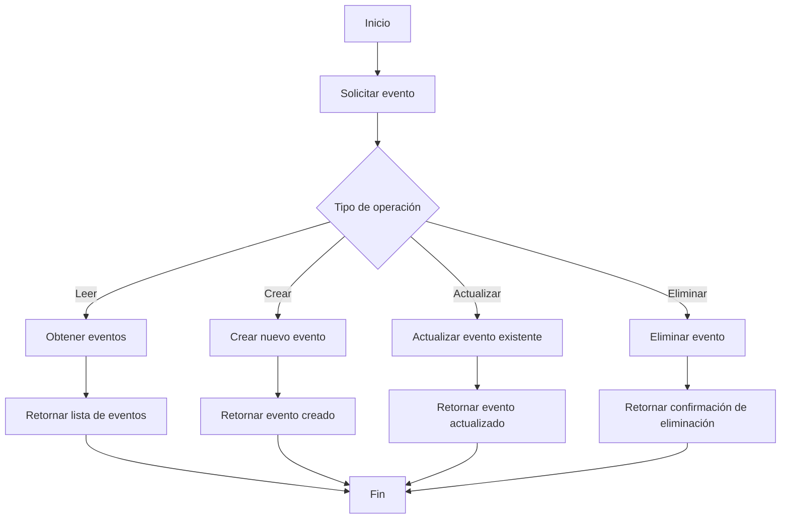

# Proyecto SI-8811-A

Bienvenido al proyecto SI-8811, una API para gestionar eventos utilizando .NET y MongoDB. Este proyecto está diseñado para facilitar la creación, lectura, actualización y eliminación de eventos en un entorno académico.

## Diagrama Api .Net


### Descripción de Componentes

- **Cliente**: El usuario o aplicación que hace solicitudes a la API.
- **EventosController**: Controlador que maneja las solicitudes HTTP.
- **MongoDB Eventos**: Base de datos para almacenar los eventos.
- **Validaciones**: Lógica para validar los datos de entrada.
- **Autenticación**: Mecanismo de seguridad para acceso a la API.
- **Manejo de Errores**: Gestión de errores y respuestas adecuadas.


## Índice

- [Tecnologías Utilizadas](#tecnologías-utilizadas)
- [Configuración del Proyecto](#configuración-del-proyecto)
- [Uso de Git](#uso-de-git)
- [GitHub Actions](#github-actions)
- [Publicación](#publicación)
- [Contribución](#contribución)
- [Documentación](#documentación)

## Tecnologías Utilizadas

- **.NET Core**: Framework para construir la API.
- **MongoDB**: Base de datos NoSQL para almacenar información de eventos.
- **Git**: Control de versiones.


## Configuración del Proyecto

1. **Clonar el Repositorio**:
   ```bash
   git clone https://github.com/tuusuario/proyecto-si-8811.git
   cd proyecto-si-8811
   ```

2. **Configuración de MongoDB**:
   - Crea un archivo `appsettings.json` en la raíz del proyecto y añade la configuración de MongoDB:
   ```json
   {
     "Logging": {
       "LogLevel": {
         "Default": "Information",
         "Microsoft.AspNetCore": "Warning"
       }
     },
     "MongoDBSettings": {
       "ConnectionString": "TuCadenaDeConexion",
       "DatabaseName": "TuNombreDeBaseDeDatos"
     }
   }
   ```

3. **Ejecutar el Proyecto**:
   - Usa el siguiente comando para ejecutar la API:
   ```bash
   dotnet run
   ```

## Uso de Git

- Este proyecto utiliza **GitFlow** como modelo de branching. Las ramas se crean para cada nueva característica o corrección de errores, asegurando un flujo de trabajo organizado.
- **Tareas completadas**: Las tareas del proyecto están registradas en **GitHub Projects** y están vinculadas a las respectivas ramas.

## GitHub Actions

- Se han implementado **GitHub Actions** para automatizar la construcción y el despliegue del proyecto, asegurando una integración continua y un despliegue seguro.

## Publicación

- El proyecto ha sido publicado para consumo, pero **no** se encuentra disponible en GitHub.

## Contribución

- Se agradecen las contribuciones al proyecto. Por favor, sigue las siguientes pautas:
  - Haz un fork del repositorio.
  - Crea una nueva rama para tu característica o corrección de errores.
  - Realiza tus cambios y envía un pull request.

## Documentación

- La documentación del proyecto está actualizada en el **README** y se han incluido diagramas en formato **Mermaid**. Asegúrate de revisar estos diagramas para una comprensión visual del sistema.



## Exposición

- El proyecto ha sido presentado, y se ha utilizado herramientas adecuadas para su exposición. 
- El enfoque y la claridad en la presentación fueron bien recibidos, y se respondieron a las preguntas de manera efectiva.

---

Gracias por tu interés en el proyecto SI-8811. ¡Esperamos tus contribuciones y feedback!

## Swagger UI

## Pruebas Unitarias Api Eventos 


### API Documentation

This project includes an API that allows you to manage events. Below are the details of the API endpoints defined in the Swagger UI.

### Base URL
`http://localhost:33041/swagger/v1/swagger.json`

### Endpoints

#### Evento

- **GET** `/Evento`
  - **Description**: Retrieves a list of events.
  - **Responses**:
    - **200**: Success
      - **Media Type**: `text/plain`
      - **Example Value**:
      ```json
      [
        {
          "id": "string",
          "nombre": "string",
          "fechaInicio": "2024-10-05T21:31:41.596Z",
          "fechaTermino": "2024-10-05T21:31:41.596Z",
          "facultad": "string"
        }
      ]
      ```

- **POST** `/Evento`
  - **Description**: Creates a new event.
  - **Request Body** (application/json):
    - **Example Value**:
    ```json
    {
      "id": "string",
      "nombre": "string",
      "fechaInicio": "2024-10-05T21:31:41.597Z",
      "fechaTermino": "2024-10-05T21:31:41.597Z",
      "facultad": "string"
    }
    ```
  - **Responses**:
    - **200**: Success
      - **Media Type**: `text/plain`
      - **Example Value**:
      ```json
      {
        "id": "string",
        "nombre": "string",
        "fechaInicio": "2024-10-05T21:31:41.598Z",
        "fechaTermino": "2024-10-05T21:31:41.598Z",
        "facultad": "string"
      }
      ```

- **GET** `/Evento/{id}`
  - **Description**: Retrieves a specific event by its ID.
  - **Parameters**:
    - **id**: `string` (path) - The ID of the event.
  - **Responses**:
    - **200**: Success
      - **Media Type**: `text/plain`
      - **Example Value**:
      ```json
      {
        "id": "string",
        "nombre": "string",
        "fechaInicio": "2024-10-05T21:31:41.599Z",
        "fechaTermino": "2024-10-05T21:31:41.599Z",
        "facultad": "string"
      }
      ```

- **PUT** `/Evento/{id}`
  - **Description**: Updates a specific event by its ID.
  - **Parameters**:
    - **id**: `string` (path) - The ID of the event.
  - **Request Body** (application/json):
    - **Example Value**:
    ```json
    {
      "id": "string",
      "nombre": "string",
      "fechaInicio": "2024-10-05T21:31:41.600Z",
      "fechaTermino": "2024-10-05T21:31:41.600Z",
      "facultad": "string"
    }
    ```
  - **Responses**:
    - **200**: Success
      - **Media Type**: `text/plain`
      - **Example Value**:
      ```json
      {
        "id": "string",
        "nombre": "string",
        "fechaInicio": "2024-10-05T21:31:41.600Z",
        "fechaTermino": "2024-10-05T21:31:41.600Z",
        "facultad": "string"
      }
      ```

- **DELETE** `/Evento/{id}`
  - **Description**: Deletes a specific event by its ID.
  - **Parameters**:
    - **id**: `string` (path) - The ID of the event.
  - **Responses**:
    - **200**: Success

### Schema

#### Evento
```json
{
  "id": "string",
  "nombre": "string",
  "fechaInicio": "string($date-time)",
  "fechaTermino": "string($date-time)",
  "facultad": "string"
}
```

