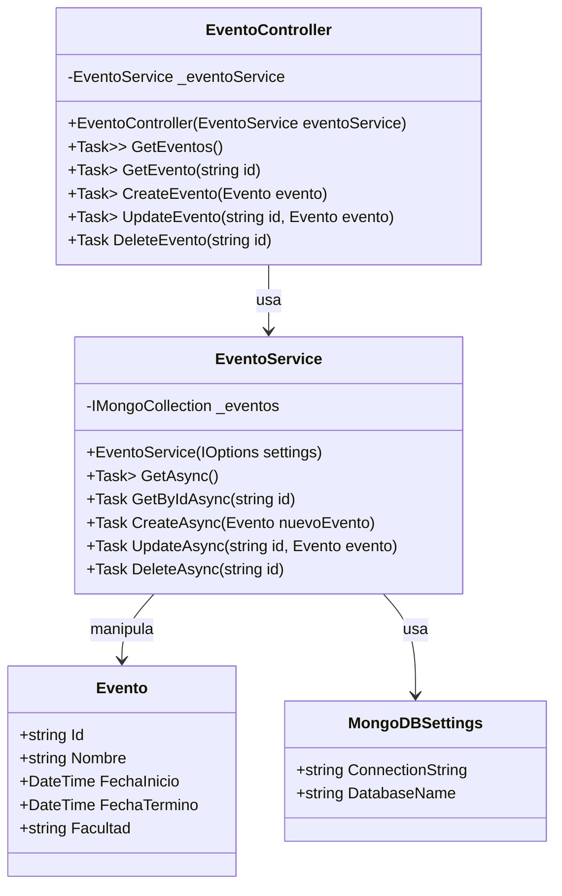

# Proyecto SI-8811

Bienvenido al proyecto SI-8811, una API para gestionar eventos utilizando .NET y MongoDB. Este proyecto está diseñado para facilitar la creación, lectura, actualización y eliminación de eventos en un entorno académico.

## Índice

- [Tecnologías Utilizadas](#tecnologías-utilizadas)
- [Configuración del Proyecto](#configuración-del-proyecto)
- [Uso de Git](#uso-de-git)
- [GitHub Actions](#github-actions)
- [Publicación](#publicación)
- [Contribución](#contribución)
- [Documentación](#documentación)

## Tecnologías Utilizadas

- **.NET Core**: Framework para construir la API.
- **MongoDB**: Base de datos NoSQL para almacenar información de eventos.
- **Git**: Control de versiones.
- **GitHub Actions**: Automatización de construcción y despliegue.

## Configuración del Proyecto

1. **Clonar el Repositorio**:
   ```bash
   git clone https://github.com/tuusuario/proyecto-si-8811.git
   cd proyecto-si-8811
   ```

2. **Configuración de MongoDB**:
   - Crea un archivo `appsettings.json` en la raíz del proyecto y añade la configuración de MongoDB:
   ```json
   {
     "Logging": {
       "LogLevel": {
         "Default": "Information",
         "Microsoft.AspNetCore": "Warning"
       }
     },
     "MongoDBSettings": {
       "ConnectionString": "TuCadenaDeConexion",
       "DatabaseName": "TuNombreDeBaseDeDatos"
     }
   }
   ```

3. **Ejecutar el Proyecto**:
   - Usa el siguiente comando para ejecutar la API:
   ```bash
   dotnet run
   ```

## Uso de Git

- Este proyecto utiliza **GitFlow** como modelo de branching. Las ramas se crean para cada nueva característica o corrección de errores, asegurando un flujo de trabajo organizado.
- **Tareas completadas**: Las tareas del proyecto están registradas en **GitHub Projects** y están vinculadas a las respectivas ramas.

## GitHub Actions

- Se han implementado **GitHub Actions** para automatizar la construcción y el despliegue del proyecto, asegurando una integración continua y un despliegue seguro.

## Publicación

- El proyecto ha sido publicado para consumo, pero **no** se encuentra disponible en GitHub.

## Contribución

- Se agradecen las contribuciones al proyecto. Por favor, sigue las siguientes pautas:
  - Haz un fork del repositorio.
  - Crea una nueva rama para tu característica o corrección de errores.
  - Realiza tus cambios y envía un pull request.

## Documentación

- La documentación del proyecto está actualizada en el **README** y se han incluido diagramas en formato **Mermaid**. Asegúrate de revisar estos diagramas para una comprensión visual del sistema.



## Exposición

- El proyecto ha sido presentado, y se ha utilizado herramientas adecuadas para su exposición. 
- El enfoque y la claridad en la presentación fueron bien recibidos, y se respondieron a las preguntas de manera efectiva.

---

Gracias por tu interés en el proyecto SI-8811. ¡Esperamos tus contribuciones y feedback!
